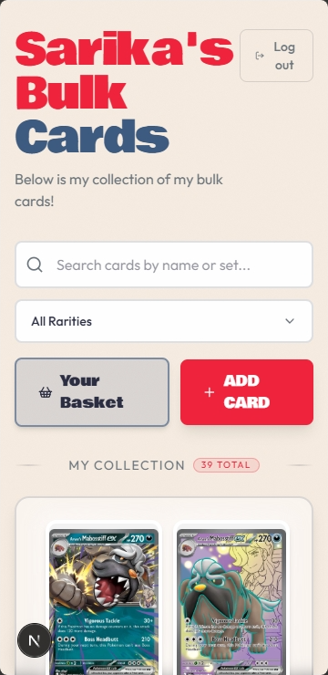
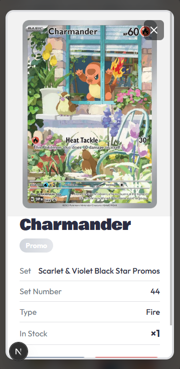
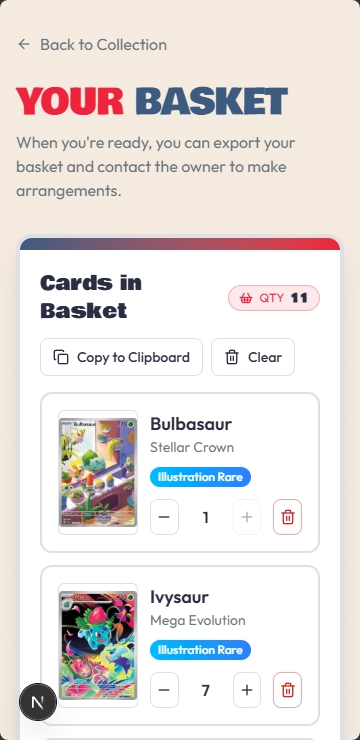
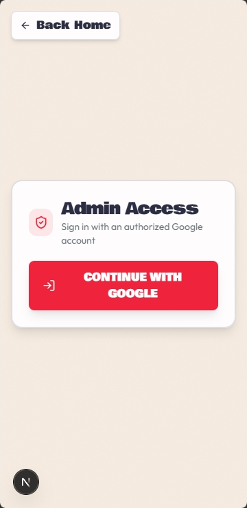

## Your TCG Collection

Your TCG Collection is a modern web app for tracking and managing a personal Pokemon trading card collection. It lets collectors search cards, add owned cards with stock quantities and edit inventory. Site visitors can build a basket of cards, and quickly export basket contents to the clipboard for sharing.

The app is designed for fast day-to-day collection management with a responsive UI, URL-based filtering and pagination, helpful toast feedback, and stock-aware basket controls that prevent over-requesting beyond available quantity.

| Home                                                                           | Card Modal                                                                           | Basket                                                                       |
| ------------------------------------------------------------------------------ | ------------------------------------------------------------------------------------ | ---------------------------------------------------------------------------- |
|  |  |  |

## Getting Started

To get started, you must first populate a `.env` file.

### Environment Variables

This project includes a `.env.example` file. Copy it to `.env` and fill in the required values for your environment. The sections below describe what's required.

#### App Branding and URL

- `NEXT_PUBLIC_SITE_TITLE`: Site title shown in browser tabs, on the homepage and metadata
- `NEXT_PUBLIC_SITE_DESCRIPTION`: Short site description used in the homepage and metadata.
- `NEXT_PUBLIC_BASE_URL`: Public origin for the app (for example `http://localhost:3000` in local dev).
- `NEXT_PUBLIC_BASE_PATH`: Optional base path if deploying under a subpath (leave empty for root).

#### Access Control

- `ADMIN_EMAILS`: Comma-separated list of emails allowed to access admin actions.

#### Authentication (Auth.js / NextAuth)

- `NEXTAUTH_SECRET`: Secret used by Auth.js to sign/encrypt session data.
  You can generate one with the command: `openssl rand -base64 32`
- `NEXTAUTH_URL`: Full auth callback base URL, it's `{NEXT_PUBLIC_BASE_URL}{NEXT_PUBLIC_BASE_PATH}/api/auth`.
- `AUTH_GOOGLE_ID`: Google OAuth client ID. Obtained by configuring a project on `google cloud console`
- `AUTH_GOOGLE_SECRET`: Google OAuth client secret. Obtained by configuring a project on `google cloud console`

#### Database

- `MONGODB_URI`: MongoDB connection string used by the app. Consider using `MongoDB Atlas`, they have an amazing free tier.

###

Once your `.env` file is populated, you're ready to get started! Run these commands on your console to spin up a local development instance of the app.

```bash
gitsubmodule update --init --recursive
npm install
npm run seed:sets
npm run seed:pokemon-cards
npm run dev
```

Note: you must run the seed commands on your production instance to ensure your database is populated with cards.

## Admin Actions

To login as an admin, visit the `/admin` URL. Then login with a gmail that you previously added to the `ADMIN_EMAILS` environment variable.



Once logged in as an admin, you'll be able to access `Add Card` and `Edit` functionalities.

## Deployment

`Netlify` is a great option to deploy this app. It can easily connect to your github and deploy to a public URL with amazing limits for free tier.
